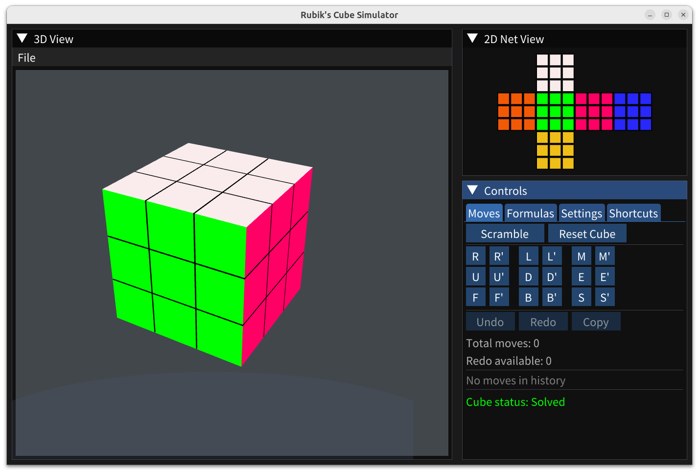

# Rubik's Cube Simulator

A 3D Rubik's cube simulator built with C++, ImGUI, and OpenGL with advanced features including animations, formula execution, and undo/redo capabilities.



## Features

### Core Functionality
- Interactive 2D unfolded cube visualization
- Interactive 3D isometric view with mouse controls
- Full set of Rubik's cube moves (U, D, L, R, F, B and their primes, plus slice moves M, E, S)
- Complete axis rotations (X, Y, Z and their primes) for cube orientation
- Real-time cube state tracking and solvable state detection
- Undo/Redo system with move history management
- Scramble function with random move generation

### Advanced Features
- **3D Animation System**: Smooth rotation animations for all moves with adjustable speed
- **Formula System**:
  - Load and execute formulas from files
  - Execute formulas in forward or reverse
  - Step-by-step execution mode
  - Loop syntax support for repeated sequences
- **Customization**:
  - Adjustable 2D and 3D view scales
  - Custom color settings for each face
  - Persistent configuration saving
- **Mouse Controls**:
  - 3D View: Left-click drag (XY rotation), Right-click drag (Z rotation), Scroll wheel (Z rotation + zoom)
  - 2D View: Mouse wheel zoom
- **Keyboard Shortcuts**: Comprehensive keyboard support with Shift+Key for prime moves, fullscreen toggle
- **Settings Persistence**: All preferences saved to config.json

## Requirements

- **CMake**: 3.15 or later
- **C++ Compiler**: Supporting C++17 (GCC, Clang, or MSVC)
- **GLFW3**: For window management
- **OpenGL**: For 3D rendering

### Installing Dependencies

#### Ubuntu/Debian:
```bash
sudo apt-get update
sudo apt-get install cmake libglfw3-dev libgl1-mesa-dev
```

#### Arch Linux:
```bash
sudo pacman -S cmake glfw mesa
```

#### macOS:
```bash
brew install cmake glfw
```

## Building

1. Clone ImGUI (required, first time only):
```bash
cd third_party
git clone https://github.com/ocornut/imgui.git
cd ..
```

2. Build the project:
```bash
mkdir build && cd build
cmake ..
make
```

3. Run the application:
```bash
./rubiks-cube
```

Or from project root:
```bash
cmake -S . -B build
make -C build
./build/rubiks-cube
```

## Usage

### Quick Start
- Use the move buttons (R, R', L, L', etc.) to rotate cube faces
- Adjust Scale sliders to zoom in/out
- Click "Scramble" to generate random moves
- Click "Reset Cube" to return to the solved state
- Use "Undo" and "Redo" buttons to navigate move history
- Click "Copy" to copy move history to clipboard

### Keyboard Shortcuts
- **U/D/L/R/F/B/M/E/S**: Execute corresponding move (clockwise)
- **X/Y/Z**: Execute axis rotation (clockwise)
- **Shift+Key**: Execute prime move (counter-clockwise)
- **Space**: Reset 3D view to default angles
- **ESC**: Reset cube to solved state
- **Ctrl+Z**: Undo last move
- **Ctrl+R**: Redo last undone move
- **Ctrl+S**: Scramble cube
- **Ctrl+Q**: Quit application
- **F11**: Toggle fullscreen mode
- **Example**: 'U' = U move, 'Shift+U' = U' move, 'X' = X axis rotation

### Formula System
1. Create formulas in the 'formula' directory (one file per category)
2. Each file contains multiple formula items with names and move sequences
3. Supports special syntax:
   - Regular moves: "R U R' U'"
   - Loop syntax: "R U R' U'" loop 3 (repeats sequence 3 times)
4. Formula commands:
   - **Execute**: Runs the formula sequence
   - **Execute Reverse**: Runs moves in reverse with inverse
   - **Step**: Executes one move at a time
   - **Reset Step**: Exits step-by-step mode

### Settings and Configuration
- **Animation**: Enable/disable animations and adjust speed (0.1x to 3.0x)
- **Colors**: Customize each face color (persisted to ~/.rubiks-cube/config.json)
- **Views**: Adjust 2D and 3D scale, rotation angles
- **Reset to Defaults**: Restore default colors and settings

## Cube Notation

### Basic Moves
- **U**: Up face clockwise
- **U'**: Up face counter-clockwise
- **D**: Down face clockwise
- **D'**: Down face counter-clockwise
- **L**: Left face clockwise
- **L'**: Left face counter-clockwise
- **R**: Right face clockwise
- **R'**: Right face counter-clockwise
- **F**: Front face clockwise
- **F'**: Front face counter-clockwise
- **B**: Back face clockwise
- **B'**: Back face counter-clockwise

### Advanced Slice Moves
- **M**: Middle slice (between L and R) clockwise
- **M'**: Middle slice counter-clockwise
- **E**: Equator slice (between U and D) clockwise
- **E'**: Equator slice counter-clockwise
- **S**: Standing slice (between F and B) clockwise
- **S'**: Standing slice counter-clockwise

### Double Moves (180° Rotation)
- **U2/D2/L2/R2/F2/B2**: 180° rotation of corresponding face
- **M2/E2/S2**: 180° rotation of corresponding slice
- **X2/Y2/Z2**: 180° rotation around corresponding axis

Example: "U2" rotates the Up face 180 degrees (same as "U U").

### Axis Rotations (Whole Cube)
- **X**: Rotate entire cube around X-axis (right-left axis), equivalent to R M' L'
- **X'**: Rotate entire cube counter-clockwise around X-axis
- **Y**: Rotate entire cube around Y-axis (up-down axis), equivalent to U E' D'
- **Y'**: Rotate entire cube counter-clockwise around Y-axis
- **Z**: Rotate entire cube around Z-axis (front-back axis), equivalent to F S B'
- **Z'**: Rotate entire cube counter-clockwise around Z-axis

## Project Structure

```
src/
├── main.cpp      - Application entry point, main loop, and UI
├── cube.h        - Cube state representation and move logic
├── cube.cpp      - Cube implementation with rotation algorithms
├── renderer.h    - 2D/3D rendering and animation management
├── renderer.cpp  - Renderer implementation using ImGui
├── formula.h     - Formula system for move sequences
├── formula.cpp   - Formula parsing and execution
├── config.h      - Configuration management for colors and settings
└── config.cpp    - Config file I/O operations

third_party/
└── imgui/       - ImGUI library

formula/         - User formula files (created automatically)
```

## Configuration File

Settings are saved to `~/.rubiks-cube/config.json` including:
- Custom colors for each face
- Animation preferences (enabled/disabled, speed)
- View parameters (scales, rotations)

## Formula File Format

Example formula file (`formula/basics.txt`):
```
# Simple algorithms
OLL: F R U R' U' F'
PLL: U R U' L' U R' U' L2 U R' U' L'
# Loop example
Sexy Move: R U R' U' loop 3
```

Each line should be in format: `name: move_sequence` or `name: move_sequence loop N`

## License

MIT
