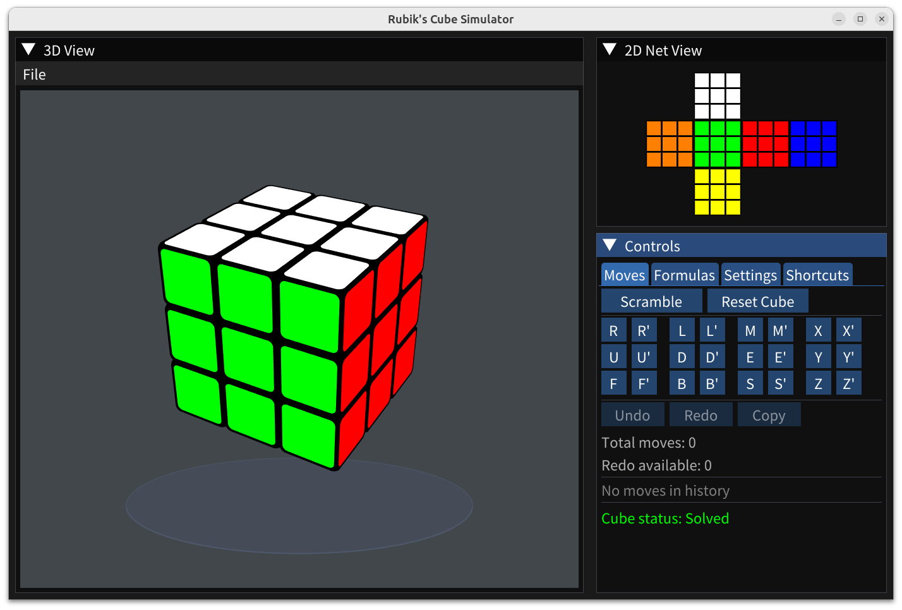

# Rubik's Cube Simulator

A 3D Rubik's cube simulator built with C++, [Dear ImGui](https://github.com/ocornut/imgui), and OpenGL with advanced features including dual rendering modes, shader-based raymarching, animations, formula execution, and undo/redo capabilities.



## Version 1.3 Highlights

- **Shader Renderer (Raymarching SDF)**: New GLSL 330 renderer using signed distance fields for smooth, anti-aliased cube rendering with dual lighting
- **Dual 3D Rendering Modes**: Switch between classic OpenGL fixed-pipeline and modern Shader renderer in Settings
- **Dual Lights**: Two light sources (left-front and right-front above camera) with brighter diffuse/specular shading
- **Anti-Aliasing**: Silhouette coverage, smoothstep sticker edges, and 8x MSAA support
- **Architectural Improvements**: Undo/Redo moved to RubiksCube, RendererType enum, CubeConfig, shared coordinate constants between renderers
- **Shader System**: Standalone .glsl files with CMake compile-time header generation
- **One-Command Build**: `make` handles everything including automatic ImGui download

## Features

### Core Functionality
- Interactive 2D unfolded cube visualization
- Interactive 3D isometric view with mouse controls
- Full set of Rubik's cube moves (U, D, L, R, F, B and their primes, plus slice moves M, E, S)
- Complete axis rotations (X, Y, Z and their primes) for cube orientation
- Real-time cube state tracking and solvable state detection
- Undo/Redo system with move history management
- Scramble function with random move generation

### 3D Rendering
- **OpenGL Fixed-Pipeline Renderer**: Classic rendering with pre-computed vertex arrays and rounded sticker corners
- **Shader Renderer (Raymarching SDF)**: Modern GLSL 330 renderer using signed distance fields
  - Face colors rendered directly on cubies via SDF (no separate sticker geometry)
  - Dual lighting with diffuse and specular shading
  - Anti-aliasing with silhouette coverage and smoothstep sticker edges
  - 8x MSAA support
  - Optimized raymarching with tetrahedron normals, hoisted rotation, and early termination
- **Renderer Switching**: Choose between OpenGL and Shader renderers in Settings (persisted to config)

### Advanced Features
- **3D Animation System**: Smooth rotation animations for all moves with adjustable speed
- **Formula System**:
  - Load and execute formulas from files
  - Execute formulas in forward or reverse
  - Step-by-step execution mode
  - Loop syntax support for repeated sequences
- **Customization**:
  - Adjustable 2D and 3D view scales
  - Custom color settings for each face
  - Persistent configuration saving
- **Mouse Controls**:
  - 3D View: Left-click drag (XY rotation), Right-click drag (Z rotation), Scroll wheel (Z rotation + zoom)
  - 2D View: Mouse wheel zoom
- **Keyboard Shortcuts**: Comprehensive keyboard support with Shift+Key for prime moves, fullscreen toggle
- **Scale & Gap Adjustment**: Keyboard shortcuts to adjust cube scale and gap in real-time
- **Settings Persistence**: All preferences saved to config.ini

## Requirements

- **CMake**: 3.15 or later
- **C++ Compiler**: Supporting C++17 (GCC, Clang, or MSVC)
- **GLFW3**: For window management
- **OpenGL 3.3+**: For shader-based rendering (OpenGL 2.1+ for fixed-pipeline mode)
- **GLM**: OpenGL Mathematics library
- **[Dear ImGui](https://github.com/ocornut/imgui)**: Immediate mode GUI library

### Installing Dependencies

#### Ubuntu/Debian:
```bash
sudo apt-get update
sudo apt-get install cmake libglfw3-dev libgl1-mesa-dev libglm-dev
```

#### Arch Linux:
```bash
sudo pacman -S cmake glfw mesa glm
```

#### macOS:
```bash
brew install cmake glfw glm
```

## Quick Start

One command to build and run:
```bash
make
```

This handles everything: downloads ImGui automatically, runs CMake, builds, and launches the application.

## Building

1. Build the project:
```bash
mkdir build && cd build
cmake ..
make -j
```

2. Run the application:
```bash
./rubiks-cube
```

Or from project root:
```bash
cmake -S . -B build
cmake --build build -j
./build/rubiks-cube
```

## Usage

### Quick Start
- Use the move buttons (R, R', L, L', etc.) to rotate cube faces
- Adjust Scale sliders to zoom in/out
- Click "Scramble" to generate random moves
- Click "Reset Cube" to return to the solved state
- Use "Undo" and "Redo" buttons to navigate move history
- Click "Copy" to copy move history to clipboard

### Keyboard Shortcuts
- **U/D/L/R/F/B/M/E/S**: Execute corresponding move (clockwise)
- **X/Y/Z**: Execute axis rotation (clockwise)
- **Shift+Key**: Execute prime move (counter-clockwise)
- **Space**: Reset 3D view to default angles
- **ESC**: Reset cube to solved state
- **Ctrl+Z**: Undo last move
- **Ctrl+R**: Redo last undone move
- **Ctrl+S**: Scramble cube
- **Ctrl+P**: Toggle celebration mode
- **Ctrl+Q**: Quit application
- **F11**: Toggle fullscreen mode
- **Example**: 'U' = U move, 'Shift+U' = U' move, 'X' = X axis rotation

### Formula System
1. Create formulas in the 'formula' directory (one file per category)
2. Each file contains multiple formula items with names and move sequences
3. Supports special syntax:
   - Regular moves: "R U R' U'"
   - Loop syntax: "R U R' U'" loop 3 (repeats sequence 3 times)
4. Formula commands:
   - **Execute**: Runs the formula sequence
   - **Execute Reverse**: Runs moves in reverse with inverse
   - **Step**: Executes one move at a time
   - **Reset Step**: Exits step-by-step mode

### Settings and Configuration
- **Animation**: Enable/disable animations and adjust speed (0.1x to 3.0x)
- **Colors**: Customize each face color (persisted to ~/.rubiks-cube/config.ini)
- **Views**: Adjust 2D and 3D scale, rotation angles
- **Reset to Defaults**: Restore default colors and settings
- **Renderer Selection**: Switch between OpenGL and Shader rendering modes

## Cube Notation

### Basic Moves
- **U**: Up face clockwise
- **U'**: Up face counter-clockwise
- **D**: Down face clockwise
- **D'**: Down face counter-clockwise
- **L**: Left face clockwise
- **L'**: Left face counter-clockwise
- **R**: Right face clockwise
- **R'**: Right face counter-clockwise
- **F**: Front face clockwise
- **F'**: Front face counter-clockwise
- **B**: Back face clockwise
- **B'**: Back face counter-clockwise

### Advanced Slice Moves
- **M**: Middle slice (between L and R) clockwise
- **M'**: Middle slice counter-clockwise
- **E**: Equator slice (between U and D) clockwise
- **E'**: Equator slice counter-clockwise
- **S**: Standing slice (between F and B) clockwise
- **S'**: Standing slice counter-clockwise

### Double Moves (180° Rotation)
- **U2/D2/L2/R2/F2/B2**: 180° rotation of corresponding face
- **M2/E2/S2**: 180° rotation of corresponding slice
- **X2/Y2/Z2**: 180° rotation around corresponding axis

Example: "U2" rotates the Up face 180 degrees (same as "U U").

### Axis Rotations (Whole Cube)
- **X**: Rotate entire cube around X-axis (right-left axis), equivalent to R M' L'
- **X'**: Rotate entire cube counter-clockwise around X-axis
- **Y**: Rotate entire cube around Y-axis (up-down axis), equivalent to U E' D'
- **Y'**: Rotate entire cube counter-clockwise around Y-axis
- **Z**: Rotate entire cube around Z-axis (front-back axis), equivalent to F S B'
- **Z'**: Rotate entire cube counter-clockwise around Z-axis

## Project Structure

```
src/
├── main.cpp                  - Application entry point
├── app.h / app.cpp           - Application class with main loop and UI
├── cube.h / cube.cpp         - Cube state, move logic, undo/redo
├── move.h / move.cpp         - Move parsing, execution and scramble logic
├── color.h / color.cpp       - Color definitions and CubeConfig (formerly ColorConfig)
├── animator.h / animator.cpp - Animation controller with easing
├── renderer.h / renderer.cpp - CubeRenderer facade with renderer switching
├── renderer_2d.h / renderer_2d.cpp - 2D unfolded cube view
├── renderer_3d.h             - 3D renderer interface (IRenderer3D)
├── renderer_3d_opengl.h / renderer_3d_opengl.cpp - OpenGL fixed-pipeline 3D renderer
├── renderer_3d_shader.h / renderer_3d_shader.cpp - GLSL raymarching SDF 3D renderer
├── gl_loader.h               - OpenGL function loader
├── model.h / model.cpp       - 3D model loader
├── shader.h / shader.cpp     - Shader compilation utilities
├── shaders/                  - GLSL shader source files
│   ├── vertex.glsl / fragment.glsl        - Shader renderer SDF shaders
│   └── cubie.vert.glsl / cubie.frag.glsl  - Per-cubie shaders
├── formula.h / formula.cpp   - Formula system for move sequences
├── config.h / config.cpp     - Configuration management (INI format, RendererType enum)

third_party/
└── imgui/                    - ImGUI library (auto-downloaded at build time)

formula/                      - User formula files (created automatically)
```

## Architecture

The application follows a modular architecture with clear separation of concerns:

- **RubiksCube**: Pure data model with move logic and undo/redo history
- **CubeRenderer**: Facade class that coordinates rendering and renderer switching (RendererType enum)
- **Renderer3DOpenGL**: OpenGL fixed-pipeline renderer with pre-computed vertex arrays
- **Renderer3DShader**: Modern GLSL 330 raymarching SDF renderer with dual lighting and anti-aliasing
- **CubeAnimator**: Manages animation state, timing, and easing functions
- **Renderer2D**: Stateless 2D unfolded cube visualization
- **CubeConfig**: Centralized color and renderer configuration
- **ViewState**: View rotation angles and scale factors

## Configuration File

Settings are saved to `~/.rubiks-cube/config.ini` using a simple INI format (`key = value`), including:
- Custom colors for each face (e.g. `front = 0.0, 0.8, 0.4`)
- Renderer selection (OpenGL or Shader)
- Animation preferences (enabled/disabled, speed)
- Easing type

## Formula File Format

Example formula file (`formula/basics.txt`):
```
# Simple algorithms
OLL: F R U R' U' F'
PLL: U R U' L' U R' U' L2 U R' U' L'
# Loop example
Sexy Move: R U R' U' loop 3
```

Each line should be in format: `name: move_sequence` or `name: move_sequence loop N`

## License

MIT

## Changelog

### v1.3.0 (2026-03-21)
- **Shader Renderer**: New raymarching SDF 3D renderer with GLSL 330, face colors rendered directly on cubies
- **Dual Rendering Modes**: Switch between OpenGL fixed-pipeline and Shader renderer in Settings
- **Dual Lighting**: Two light sources with brighter diffuse/specular shading
- **Anti-Aliasing**: Silhouette coverage, smoothstep sticker edges, 8x MSAA support
- **Shader System**: Standalone .glsl files with CMake compile-time header generation
- **Architecture**: Undo/redo moved from CubeRenderer to RubiksCube, RendererType enum for type-safe renderer selection
- **Performance**: Optimized raymarching with tetrahedron normals, hoisted rotation, early termination, reduced step count
- **Refactoring**: CubeConfig (renamed from ColorConfig), shared coordinate constants between renderers, removed unused includes
- **UI**: Scale and gap keyboard shortcuts, Renderer dropdown in Settings
- **Build**: One-command `make` with automatic ImGui download

### v1.2.0 (2026-03-16)
- **Architecture Refactoring**: CubeRenderer split into modular components (ViewState, ColorProvider, CubeAnimator, Renderer2D, Renderer3DOpenGL)
- **Double Moves**: Full support for U2/D2/L2/R2/F2/B2/M2/E2/S2/X2/Y2/Z2
- **3D Rendering Improvements**: Rounded sticker corners, circle shadow canvas, proper viewport centering
- **Configurable Animation Easing**: Linear, ease-in, ease-out, ease-in-out curves
- **Code Quality**: Application class extracted, main.cpp reduced to thin entry point
- **UI Polish**: Bigger stickers, softer colors, adjusted 2D sticker gaps

### v1.2.1 (2026-03-18)
- **Config Format**: Replaced hand-rolled JSON parser with simple INI format (`key = value`), config file renamed from `config.json` to `config.ini`
- **Code Reduction**: config.cpp reduced from 657 to 241 lines
